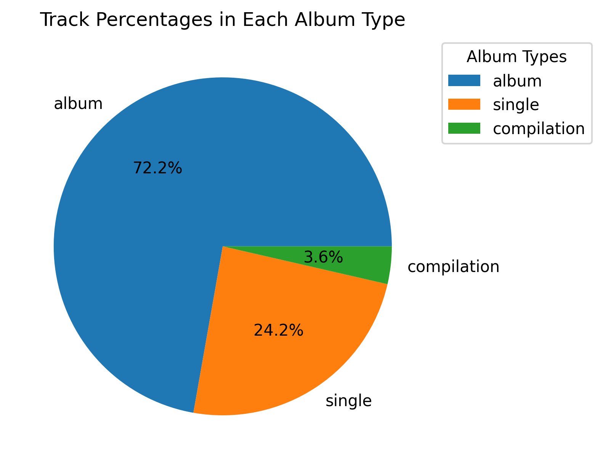
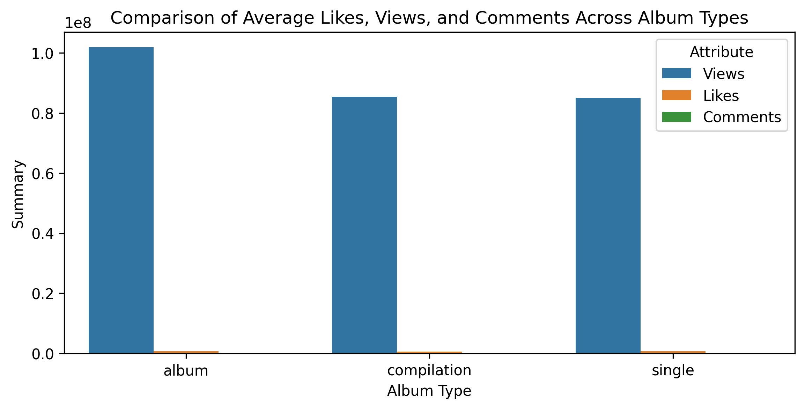
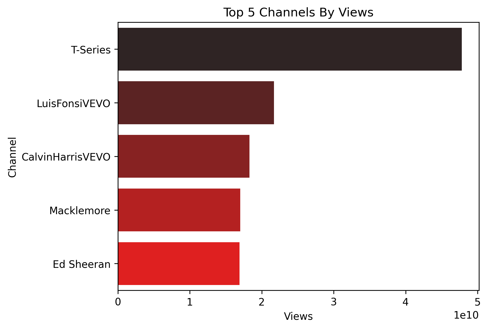
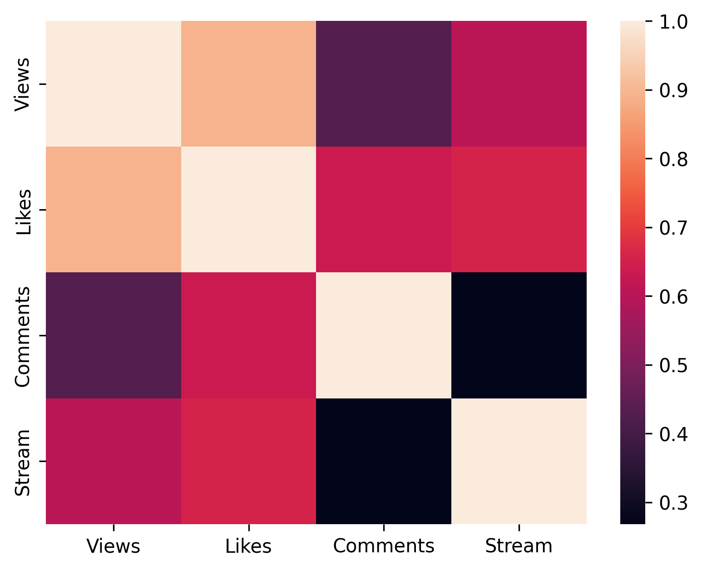
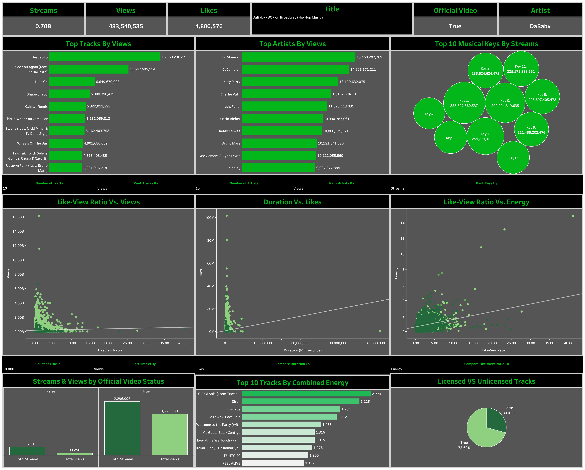

# Spotify YouTube Data Analysis Project

## Project Overview
This is an end-to-end Spotify Data Analysis Project that analyzes the relationship between Spotify music features and YouTube video performance metrics. The project demonstrates comprehensive data analysis skills from data acquisition to visualization.

## Setup


### Prerequisites
- Python 3.8+
- PostgreSQL (for SQL analysis)
- Required Python packages (see requirements.txt)

### 1. Kaggle API Setup
1. Get your Kaggle API key from [https://www.kaggle.com/settings](https://www.kaggle.com/settings).
2. Place the downloaded `kaggle.json` file in `~/.kaggle/` (Linux/Mac) or `C:\Users\<YourUsername>\.kaggle\` (Windows).
3. Run the notebook; it will authenticate with your Kaggle account automatically.

### 2. Install Dependencies
```bash
pip install -r requirements.txt
```

### 3. Run the Analysis
```bash
cd python
jupyter notebook spotifyt_book.ipynb
```

**Note**: For some queries, limits have been taken as demonstration for the readmes, queries can be run without the limits to get a bigger understanding of the picture.


## Project Structure
```
spotify_youtube_analysis/
├── data/                           # Dataset files
│   ├── Spotify Youtube Dataset.csv # Original dataset
│   ├── spyt_cleaned.csv           # Cleaned dataset
│   ├── spyt_cleaned_index.csv     # Cleaned dataset with index
│   ├── spyt_cleaned_index.xlsx    # Cleaned dataset in Excel format
│   └── ~$spyt_cleaned_index.xlsx  # Excel temp file
├── python/                         # Python analysis notebooks
│   └── spotifyt_book.ipynb        # Main analysis notebook
├── sql/                           # SQL queries and analysis
│   ├── spotifytb.session.sql      # PostgreSQL session file
│   ├── problem1.json              # Business problem 1 results
│   ├── problem3.json              # Business problem 3 results
│   ├── problem5.json              # Business problem 5 results
│   ├── problem9.json              # Business problem 9 results
│   ├── problem10.json             # Business problem 10 results
│   ├── problem12.json             # Business problem 12 results
├── plots/                         # Generated visualizations
│   ├── comparison_album_types.png # Album type comparison chart
│   ├── heatmap.png                # Correlation heatmap
│   ├── pie.png                    # Album type distribution pie chart
│   └── topfivechannels.png        # Top 5 channels by views
├── tableau/                       # Tableau dashboard files
│   ├── SpotifyDash.png            # Dashboard screenshot
│   ├── spotify_youtube_dash.twb   # Tableau workbook
│   ├── spotify_youtube_dash.twbx  # Tableau packaged workbook
│   ├── .DS_Store                  # System file
│   ├── ~spotify_youtube_dash__75081.twbr # Tableau temp file
├── spot/                          # Virtual environment
│   ├── bin/
│   ├── include/
│   ├── lib/
│   ├── pyvenv.cfg
│   ├── share/
├── requirements.txt               # Python dependencies
└── README.md                      # This file

## Recommended .gitignore
The following files and folders should be included in your .gitignore: virtual environment folders, Kaggle API keys, and system/hidden files.

```


## Analytical Methodology

### Phase 1: Data Acquisition & Preprocessing
**Data Source**: [Spotify YouTube Dataset](https://www.kaggle.com/datasets/rohitgrewal/spotify-youtube-data) from Kaggle


**Data Preprocessing**:
1. **Data Import & Initial Assessment**: Initial dataset contained 20,718 records with 28 columns
2. **Feature Selection & Removal**: Eliminated non-essential columns including:
   - `Unnamed: 0` (redundant index column)
   - `Url_spotify` (Spotify URL references)
   - `Url_youtube` (YouTube URL references) 
   - `Uri` (Spotify URI identifiers)
3. **Data Quality Enhancement**: Applied comprehensive missing value treatment, resulting in a refined dataset of 19,170 records
4. **Data Type Standardization**: 
   - Numerical features: `Views`, `Likes`, `Comments` converted to `int64`
   - Categorical features: `Artist`, `Track`, `Album`, `Album_type`, `Title`, `Channel`, `Description` converted to `str`
5. **Data Integrity Validation**: Confirmed absence of duplicate records


**Derived Metrics Development**:
- **LikeView_Ratio**: Computed as `(Likes / Views) * 100` to quantify audience engagement efficiency
- This derived metric provides insights into content quality by measuring viewer satisfaction relative to viewership


### Phase 2: Exploratory Data Analysis & Visualization

#### Analytical Visualizations & Key Findings


**1. Album Type Distribution**



- **Insight**: The distribution reveals that the majority of tracks are released as albums and singles, indicating the prevalence of these two primary release formats in the modern music industry, with albums being the dominant format followed by singles.


**2. Album Type Performance Comparison**



- **Insight**: Analysis shows that albums generate significantly higher average views compared to both compilation albums and singles, while engagement metrics (likes and comments) remain relatively consistent across all album types, suggesting that viewership is influenced by content format but engagement is consistent.


**3. Top 5 YouTube Channels by Views**



- **Insight**: The visualization clearly demonstrates the performance hierarchy among top-performing YouTube channels, revealing significant disparities in viewership and highlighting which channels have established the strongest audience presence in the music content space.


**4. Correlation Heatmap**



- **Insight**: The correlation analysis reveals a strong positive relationship between views and likes, indicating that content with higher viewership tends to receive proportionally more audience engagement, suggesting consistent audience satisfaction across popular content.


### Phase 3: Advanced Database Analytics

**Strategic Business Intelligence Queries**:


**Query 1: High-Performance Track Identification**

```sql
SELECT 
    track,
    stream
FROM spotify
WHERE stream > 1000000000
ORDER BY stream
LIMIT 5;
```


**Results (from sql/problem1.json):**

| Track | Stream |
|-------|--------|
| I Gotta Feeling | 1,001,227,038 |
| Dancing On My Own | 1,003,155,181 |
| Hey Ya! | 1,004,053,030 |
| Moves Like Jagger - Studio Recording From "The Voice" Performance | 1,004,577,500 |
| Sucker for Pain (with Wiz Khalifa, Imagine Dragons, Logic & Ty Dolla $ign feat. X Ambassadors) | 1,004,661,276 |


**Insight**: These tracks represent the highest-performing content on Spotify, all exceeding 1 billion streams, indicating exceptional cross-platform appeal and audience retention.


**Query 3: Licensed Content Engagement Analysis**

```sql
SELECT
    SUM(comments) AS total_comments
FROM spotify
GROUP BY licensed
HAVING licensed = TRUE;
```


**Results (from sql/problem3.json):**

| Total Comments |
|----------------|
| 489,958,646 |


**Insight**: Licensed content generates nearly 490 million comments, demonstrating high audience engagement and the value of proper licensing for content creators.


**Query 5: Artist Catalog Depth Assessment**

```sql
SELECT
    artist,
    COUNT(track) AS total_tracks
FROM spotify
GROUP BY artist
ORDER BY COUNT(track) DESC
LIMIT 5;
```


**Results (from sql/problem5.json):**

| Artist | Total Tracks |
|--------|--------------|
| Ray Charles | 10 |
| Joey Bada$$ | 10 |
| La Mosca Tse-Tse | 10 |
| TheFatRat | 10 |
| Lofi Fruits Music | 10 |


**Insight**: Multiple artists have exactly 10 tracks in the dataset, suggesting either a sampling methodology or these artists' complete discographies within the dataset scope.


**Query 9: Album Performance Metrics**

```sql
SELECT
    album,
    track,
    SUM(views) AS total_views
FROM spotify
GROUP BY 1,2
ORDER BY 3 DESC
LIMIT 5;
```


**Results (from sql/problem9.json):**

| Album | Track | Total Views |
|-------|-------|-------------|
| VIDA | Despacito | 16,159,296,273 |
| See You Again (feat. Charlie Puth) | See You Again (feat. Charlie Puth) | 11,547,595,554 |
| Peace Is The Mission (Extended) | Lean On | 6,649,670,008 |
| ÷ (Deluxe) | Shape of You | 5,908,399,479 |
| MUNAY | Calma - Remix | 5,328,391,392 |


**Insight**: "Despacito" leads with over 16 billion views, showing exceptional viral success. The top tracks demonstrate that both original releases and remixes can achieve massive viewership.


**Query 10: Artist Performance Ranking Analysis**

```sql
WITH cte1 AS (
SELECT
    artist,
    track,
    SUM(views) AS total_views,
    DENSE_RANK() OVER(PARTITION BY artist ORDER BY SUM(views) DESC) AS views_rank
FROM spotify
GROUP BY 1, 2
)
SELECT * FROM cte1 WHERE views_rank <= 3
LIMIT 6;
```


**Results (from sql/problem10.json):**

| Artist | Track | Total Views | Views Rank |
|--------|-------|-------------|------------|
| $NOT | Tell Em | 41,100,657 | 1 |
| $NOT | Like Me (feat. 21 dior) | 15,803,517 | 2 |
| $NOT | Mean | 13,563,870 | 3 |
| $uicideboy$ | Paris | 175,156,959 | 1 |
| $uicideboy$ | For the Last Time | 91,771,038 | 2 |
| $uicideboy$ | Kill Yourself (Part III) | 31,674,988 | 3 |


**Insight**: Window functions effectively rank tracks per artist, revealing that artists like $uicideboy$ have multiple high-performing tracks, while others like $NOT show more varied performance across their catalog.


**Query 12: Album Energy Variation Analysis**

```sql
WITH cte2 AS(
SELECT
    album,
    MAX(energy) AS max_energy,
    MIN(energy) AS min_energy
FROM 
    spotify
GROUP BY 
    album
)
SELECT
    album,
    ROUND((max_energy - min_energy)::NUMERIC, 2) AS difference_energy
FROM
    cte2
ORDER BY 2 DESC
LIMIT 5;
```


**Results (from sql/problem12.json):**

| Album | Difference Energy |
|-------|------------------|
| Spotify Singles - Holiday | 0.84 |
| Spotify Singles | 0.82 |
| Making Mirrors | 0.81 |
| Everytime We Touch (Premium Edition) | 0.81 |
| If I Can Dream: Elvis Presley with the Royal Philharmonic Orchestra | 0.79 |


**Insight**: Compilation albums like "Spotify Singles" show the highest energy variation (0.84), indicating diverse musical styles and energy levels within curated collections, while artist albums show more consistent energy profiles.


## Advanced Data Visualization & Dashboard Development

## Tableau Dashboard Documentation

### Quick Links
- **Primary Workbooks:** `spotify_youtube_dash.twb`, `spotify_youtube_dash.twbx`
- **Data File:** `data/spyt_cleaned_index.xlsx`
- **Screenshot:** `tableau/SpotifyDash.png`
<!-- - **Dashboard Link:** [SpotifyDash](https://public.tableau.com/app/profile/bishneet.rekhi/viz/spotify_youtube_dash/SpotifyDash) -->

---

### Preview



---

### 1. Overview

- **Dashboard Name/Link:** spotify_youtube_dash ([View Online](https://public.tableau.com/app/profile/bishneet.rekhi/viz/spotify_youtube_dash/SpotifyDash))
- **Creator:** Bishneet Rekhi
- **Date Created:** August 2025
- **Last Updated:** August 2025
- **Purpose:** Analyze the relationship between Spotify music features and YouTube video performance, uncovering trends in streaming, engagement, and artist/channel popularity.
- **Primary Audience:** Music industry professionals, record labels, artists, digital marketers, researchers, and data analysts.
- **Key Metrics Tracked:**
    - Total Streams, Total Views, Total Likes, Official Video status, Artist
    - Top N tracks/artists by Views, Streams, Likes, Comments, LikeView-Ratio (bar)
    - Top 10 musical keys ranked by engagement metrics (bubble)
    - Scatter plots for Like-View Ratio vs. engagement and audio features
    - Streams/Views by Official Video status (double bar)
    - Top tracks by combined energy (bar)
    - Licensed vs. Unlicensed tracks (pie)
- **Business Questions Answered:**
    - Which tracks and artists perform best across platforms?
    - What audio features drive engagement?
    - How does official video status impact streams/views?
    - What is the distribution of licensed/unlicensed content?
    - How do musical keys and energy features relate to popularity?
- **How to Use This Dashboard:**
    - Use filters to select top tracks/artists, engagement metrics, and audio features.
    - Interact with charts to drill down into specific tracks, artists, or features.
    - Compare official vs. unofficial video performance and licensing status.

---

### 2. Data Sources & Connections

- **Data Source Name:** `spyt_cleaned_index`
- **Type:** Excel File
- **File Path:** `data/spyt_cleaned_index.xlsx`
- **Approx. Size:** ~19,170 rows
- **Full Dataset Source:** [Kaggle — Spotify-YouTube Data 2025](https://www.kaggle.com/datasets/rohitgrewal/spotify-youtube-data)
- **Connection Type:** Extract (published to Tableau Server)
- **Refresh Frequency:** Monthly
- **Joins/Relationships:** Single flat file (no joins)
- **Key Filters Applied:** None
- **Dataset Columns:**  
    `Artist`, `Track`, `Album`, `Album_type`, `Danceability`, `Energy`, `Key`, `Loudness`, `Speechiness`, `Acousticness`, `Instrumentalness`, `Liveness`, `Valence`, `Tempo`, `Duration_ms`, `Title`, `Channel`, `Views`, `Likes`, `Comments`, `Description`, `Licensed`, `official_video`, `Stream`, `LikeView_Ratio`

---

### 3. Calculated Fields, Parameters & Sets

**Calculated Fields:**
- **Total Views:** `SUM([Views])`
- **Total Tracks:** `COUNTD([Track])`
- **Total Streams:** `SUM([Stream])`
- **Total Likes:** `SUM([Likes])`
- **Selected Feature Duration:**  
    ```
    CASE [Select Feature Duration]
        WHEN "Likes" THEN SUM([Likes])
        WHEN "Views" THEN SUM([Views])
        WHEN "Streams" THEN SUM([Stream])
        WHEN "Comments" THEN SUM([Comments])
    END
    ```
- **Select Feature:**  
    ```
    CASE [Select Feature]
        WHEN "Energy" THEN [Energy]
        WHEN "Danceability" THEN [Danceability]
        WHEN "Liveness" THEN [Liveness]
        WHEN "Loudness" THEN [Loudness]
        WHEN "Tempo" THEN [Tempo]
        WHEN "Valence" THEN [Valence]
        WHEN "Speechiness" THEN [Speechiness]
        WHEN "Acousticness" THEN [Acousticness]
        WHEN "Instrumentalness" THEN [Instrumentalness]
    END
    ```
- **Metric Value Keys/Artist/Track:**  
    ```
    CASE [Rank By]
        WHEN "Views" THEN SUM([Views])
        WHEN "Streams" THEN SUM([Stream])
        WHEN "Likes" THEN SUM([Likes])
        WHEN "Comments" THEN SUM([Comments])
        WHEN "Like-View Ratio" THEN SUM([Likes]) / SUM([Views])
    END
    ```
- **Combined Energy:** `[Energy] + [Liveness] + [Loudness]`

**Parameters:**
- **Number of Artists:** Integer (1–100), controls number of artists displayed
- **Number of Tracks:** Integer (1–100 or up to 19,000), controls number of tracks displayed
- **Rank By (Tracks/Artists/Keys):** String, allowable values: `Views`, `Streams`, `Likes`, `Comments`, `Like-View Ratio`
- **Select Feature:** String, allowable values: `Energy`, `Danceability`, `Liveness`, `Loudness`, `Tempo`, `Valence`, `Speechiness`, `Acousticness`, `Instrumentalness`
- **Select Feature Duration:** String, allowable values: `Likes`, `Views`, `Streams`, `Comments`

**Sets:**
- **Top N Tracks by Metric:** Set of tracks in the top N for selected metric
- **Top N Artists by Metric:** Set of artists in the top N for selected metric
- **Top N Keys by Metric:** Set of musical keys in the top N for selected metric

---

### 4. Key Components — Filters & Actions

**Dashboard Filters**
- **Title of Track:** Filters key metrics (Total Streams, Total Views, Total Likes, Official Video status, Artist) at the top of the dashboard
- **Artist/Track Name:** Search or select specific artist/track
- **Official Video Status:** Filter tracks by official/unofficial video (from `official_video` column)
- **Licensing Status:** Filter tracks by licensed/unlicensed (from `Licensed` column)
- **Album Type:** Filter by album, single, compilation, etc.
- **Channel:** Filter by YouTube channel
- **Audio Feature:** Filter by selected audio feature (from parameter)
- **Top N:** Filter to show only top N tracks/artists/keys by selected metric
- **Views, Likes, Comments, Streams:** Range or threshold filters for engagement metrics
- **Like-View Ratio:** Range filter for engagement efficiency
- **Musical Key:** Filter by musical key
- **Combined Energy:** Filter by calculated energy metric

**Dashboard Actions:**
- Filter actions for interactive charts (bar, bubble, scatter, pie)

---

### 5. Performance Considerations

- **Data Extract Size:** ~60 MB; optimized for extract mode
- **Dashboard Load Time:** ~3 seconds
- **Performance Issues:** None identified
- **Optimizations:**
    - Use parameter-driven toggles over quick filters
    - Aggregate extracts at required granularity
    - Avoid high-cardinality dimensions on detail shelf
    - Precompute derived fields

---

### 6. Access & Permissions

- **Viewer Access:** View-only; no data export
- **Edit Access:** Bishneet Rekhi (Owner/Editor)

---

### 7. Version Control & Updates

- **Version History:**
    - v1.0 – August 4, 2025 – Initial release (`spotify_youtube_dash.twb`)
    - v1.1 – August 26, 2025 – Revamped design (`spotify_youtube_dash.twbx`)
- **Change Log:** Dashboard redesign and optimization (August 4-19, 2025)
- **Ownership & Maintenance:** Bishneet Rekhi, monthly data refreshes

---

### 8. Workbook Contents

**Dashboards:**
- SpotifyDash

**Worksheets (selected):**
- Total Artists
- Total Streams
- Video
- Total Views
- Total Likes
- Top Tracks
- Top Artists
- Top Musical Keys
- Top Tracks by Combined Energy
- Licensed Vs. Unlicensed Tracks
- Streams and Views by Official Video Status
- Like-View Ratio
- Duration
- Like-View Ratio Vs Sound

---


## Troubleshooting

- **Kaggle authentication error**: Check your `~/.kaggle/kaggle.json` file
- **Database connection issues**: Verify PostgreSQL is running and credentials are correct
- **Missing plots**: Run the Python notebook to generate visualizations


## Strategic Development Roadmap

- Real-time data streaming analysis
- Machine learning models for hit prediction
- Advanced sentiment analysis of YouTube comments
- Integration with additional music platforms
- Automated report generation

---

**Note**: This project demonstrates end-to-end data analysis skills from data acquisition through visualization, with comprehensive documentation for reproducibility and collaboration.
